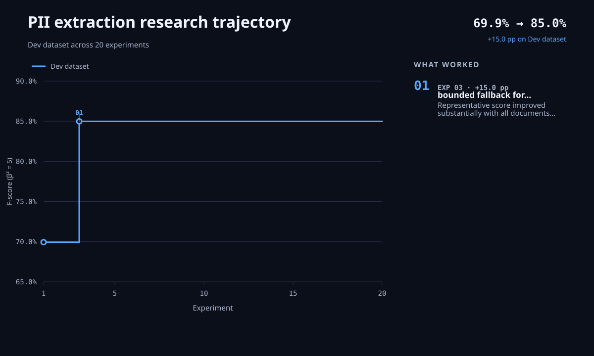

# Autoresearch Agent

Can an AI agent improve another AI system's quality by doing the research itself? This repository tests that hypothesis on a PII extraction system that finds people's names, emails, phones in documents.

Inspired by [Karpathy's Autoresearch](https://github.com/karpathy/autoresearch), it applies an
autonomous experimentation loop to optimizing an LLM system rather than training a neural network.



## How it works

The agent starts with a baseline PII extraction solution, labeled development datasets, and a fixed
evaluator. For each experiment, it:

1. Proposes a hypothesis.
2. Changes the solution to test it.
3. Evaluates the solution's quality and cost.
4. Records the result and what it learned.
5. Keeps the change when the evidence supports it; otherwise, it returns to the previous solution.

The agent repeats this process within the run and spending limits. At the end, it selects the best
solution without seeing the test data and evaluates it once on the blind final dataset. The main
metric is an F-score that weighs recall five times as heavily as precision.

**Cost tracking**: Paid model calls pass through an evaluator-owned proxy that meters spending and
enforces per-evaluation limits, while the agent tracks the cumulative run budget.

## Framework self-improvement

You can improve the autoresearch framework using feedback from the research agent. The agent records
that feedback in `REQUESTS.md` as the research proceeds. You can also run the `$autoresearch-retro`
skill after a completed run to review the experiment artifacts, identify what limited the agent, and
recommend changes to the research design, evaluator, data, environment, and repository. This creates
a feedback loop that improves the research process itself.

## Quick start

You need Python 3.12, [uv](https://docs.astral.sh/uv/), Codex, and an OpenAI API key.

```bash
git clone https://github.com/implausibleDeniability/autoresearch-agent.git
cd autoresearch-agent
uv sync
```

Create a local `.env` file:

```dotenv
OPENAI_API_KEY=your-api-key
```

Open the repository in Codex and run:

```text
$run-autoresearch
```

The skill creates a separate research worktree, runs experiments within the configured limits, and
returns a final report.
